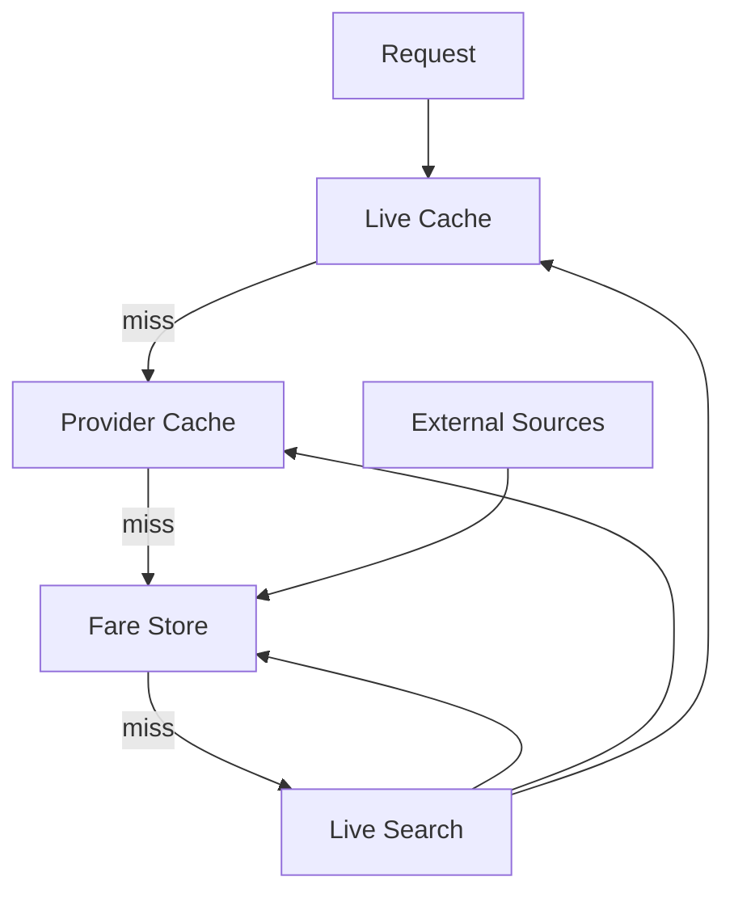
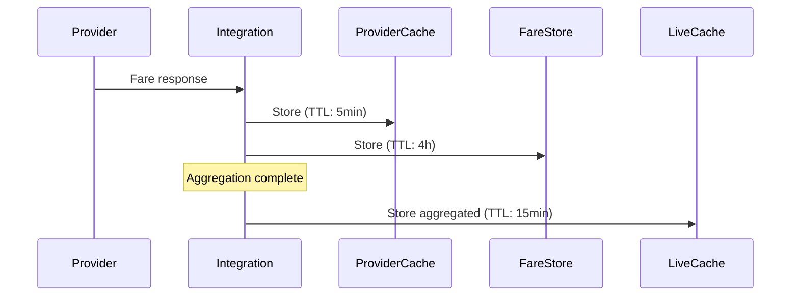
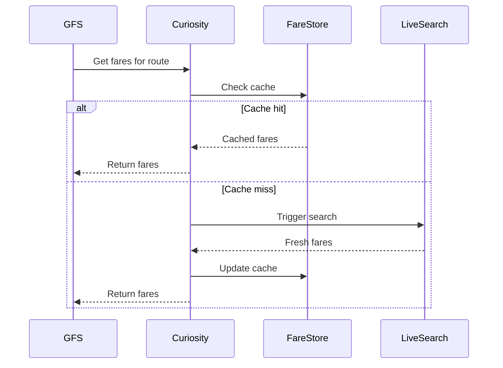
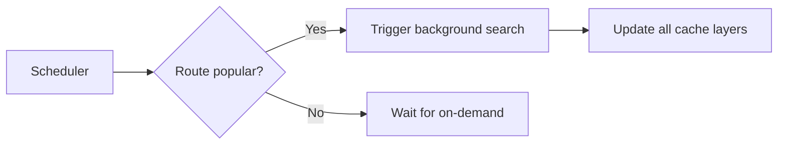
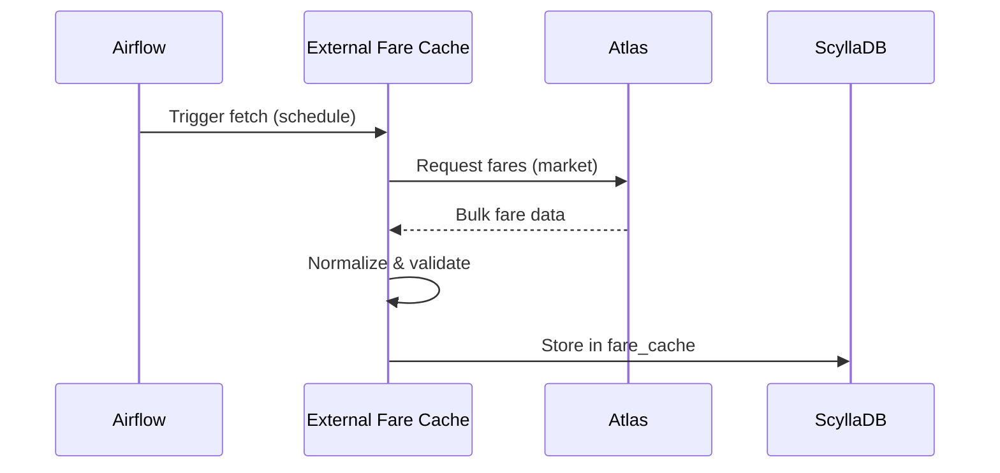

# Fare Caching

Caching is critical for Flight Shopping performance. This document explains our multi-layer caching strategy.

## Cache Layers



### Layer 1: Live Cache (Redis Cluster)

**Purpose**: Store active search results

| Property | Value |
|----------|-------|
| **Storage** | Redis Cluster |
| **TTL** | 5-15 minutes |
| **Data** | Aggregated, user-ready fares |
| **Access pattern** | Read-heavy, short-lived |

**Use case**: User is actively polling for results

```
Key: live:search:{searchId}
Contains:
- Search metadata
- Flight options
- Fares from all providers
- Aggregation status
```

### Layer 2: Provider Cache (Redis)

**Purpose**: Cache raw provider responses

| Property | Value |
|----------|-------|
| **Storage** | Redis |
| **TTL** | 5-10 minutes |
| **Data** | Raw normalized provider fares |
| **Access pattern** | Write on search, read on completion |

**Use case**: Provider response reuse within short window

```
Key: provider:{providerId}:{route}:{date}:{hash}
Contains:
- Normalized fares from single provider
- Provider metadata
- Timestamp
```

### Layer 3: Fare Store (ScyllaDB)

**Purpose**: Long-term fare cache for GFS and instant results

| Property | Value |
|----------|-------|
| **Storage** | ScyllaDB |
| **TTL** | Hours to days |
| **Data** | Historical fares, external data |
| **Access pattern** | Read-heavy, background refresh |

**Use case**: GFS responses, price trends, instant results

```
Table: fare_cache
Partition key: route + date
Clustering: provider, timestamp
Contains: Full fare details for quick retrieval
```

## Cache Strategies

### Write-Through (Live Search)

When a live search completes:



### Read-Through (GFS)

When GFS requests fares:



### Background Refresh

For popular routes, we proactively refresh cache:



## External Fare Cache

### Atlas Integration

Atlas provides bulk fare data for specific markets:



**Fetch schedule**:
- High-priority markets: Every 2 hours
- Standard markets: Every 6 hours
- Low-traffic: Daily

## Cache Keys & TTLs

### Live Cache Keys

```
live:search:{searchId}           TTL: 15min
live:search:{searchId}:flights   TTL: 15min
live:search:{searchId}:fares     TTL: 15min
live:search:{searchId}:status    TTL: 15min
```

### Provider Cache Keys

```
provider:{provider}:{route}:{date}:{cabin}   TTL: 5min
provider:{provider}:status                    TTL: 1min
```

### Static Data Keys

```
static:airline:{code}        TTL: 24h
static:airport:{code}        TTL: 24h
static:route:{from}:{to}     TTL: 24h
static:provider:{id}         TTL: 1h
```

## Cache Invalidation

### Automatic Invalidation

| Trigger | Action |
|---------|--------|
| TTL expiry | Key removed automatically |
| New search | Updates existing cache |
| Provider update | New data overwrites old |

### Manual Invalidation

For specific cases (bug fixes, data corrections):

```bash
# Clear provider cache for route
redis-cli -c DEL "provider:emirates.com:SIN:BKK:*"

# Clear live search
redis-cli -c DEL "live:search:{searchId}*"

# Force refresh from external source
curl -X POST /v1/atlas/fetch?market=SG
```

## Cache Monitoring

### Key Metrics

| Metric | Healthy | Alert |
|--------|---------|-------|
| Hit rate | >80% | <60% |
| Miss rate | <20% | >40% |
| Latency (p50) | <5ms | >20ms |
| Latency (p99) | <50ms | >200ms |
| Memory usage | <70% | >85% |
| Evictions | 0 | >100/min |

### Datadog Metrics

```
cache.hit_rate{layer:live}
cache.hit_rate{layer:provider}
cache.hit_rate{layer:fare_store}

cache.latency.p50{layer:*}
cache.latency.p99{layer:*}

redis.memory.used
redis.keys.count
scylladb.read_latency
```

## Best Practices

<AccordionGroup>
  <Accordion title="Cache Key Design">
    - Include all query parameters in key
    - Use consistent hashing for distribution
    - Keep keys short but descriptive
    - Version keys when format changes
  </Accordion>
  
  <Accordion title="TTL Selection">
    - Live cache: Short (minutes) - data changes frequently
    - Provider cache: Very short - avoid stale prices
    - Fare store: Longer (hours) - acceptable staleness for GFS
    - Static data: Long (days) - changes infrequently
  </Accordion>
  
  <Accordion title="Failure Handling">
    - Cache failures should not break search
    - Fall back to live search on cache miss
    - Log cache errors for monitoring
    - Circuit breaker for cache operations
  </Accordion>
</AccordionGroup>
