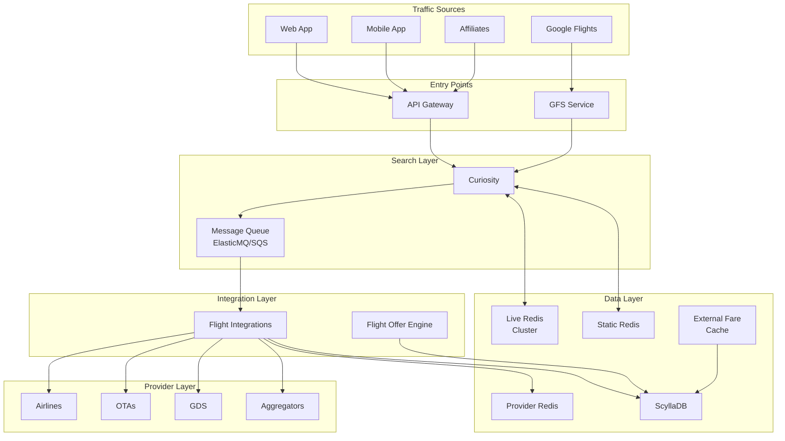

# Architecture Overview

The Flight Shopping system is a distributed, microservices-based architecture designed for high throughput, low latency, and fault tolerance.

## System Diagram

## Key Design Principles

<CardGroup cols={2}>
  <Card title="Async by Default" icon="arrows-spin">
    Search requests trigger async provider queries via message queues. Results are polled progressively.
  </Card>
  <Card title="Cache Everything" icon="database">
    Multiple cache layers (live, provider, static) minimize latency and provider load.
  </Card>
  <Card title="Fail Gracefully" icon="shield">
    Single provider failures don't break searches. Degraded mode returns cached/partial results.
  </Card>
  <Card title="Scale Horizontally" icon="server">
    Stateless services scale horizontally. Redis clusters handle data distribution.
  </Card>
</CardGroup>

## Component Overview

### Entry Layer

| Component | Purpose | Tech |
|-----------|---------|------|
| **API Gateway** | Route requests, rate limiting, auth | AWS ALB |
| **GFS Service** | Google Flights API endpoint | Java/Dropwizard |

### Orchestration Layer

| Component | Purpose | Tech |
|-----------|---------|------|
| **Curiosity** | Main search orchestrator | Java/Dropwizard |
| **Message Queue** | Async job distribution | ElasticMQ (local), SQS (prod) |

### Integration Layer

| Component | Purpose | Tech |
|-----------|---------|------|
| **Flight Integrations** | Provider API clients | Java/Dropwizard |
| **Flight Offer Engine** | Offer processing | Spring Boot/GraalVM |

### Data Layer

| Component | Purpose | Tech |
|-----------|---------|------|
| **Live Redis** | Real-time search results | Redis Cluster |
| **Provider Redis** | Raw provider responses | Redis Cluster |
| **Static Redis** | Reference data (airlines, airports) | Redis |
| **ScyllaDB** | Fare cache, long-term storage | ScyllaDB |

## Data Flow Types

### 1. Real-time Search (Live)

User-initiated searches that hit providers in real-time.

- **Latency target**: <3s to first result
- **Freshness**: Seconds old
- **Use case**: Active user searches

### 2. Cached Search (GFS)

Pre-cached or recently cached results returned immediately.

- **Latency target**: <500ms
- **Freshness**: Minutes to hours old
- **Use case**: Google Flights, instant results

### 3. Background Refresh

Periodic updates to keep cache fresh.

- **Latency target**: N/A (async)
- **Freshness**: Scheduled refresh
- **Use case**: Popular routes, partner data

## Infrastructure

### AWS Resources

| Resource | Usage |
|----------|-------|
| **EC2/ECS** | Application containers |
| **ElastiCache** | Redis clusters |
| **SQS** | Message queues (prod) |
| **S3** | Static assets, logs |
| **ALB** | Load balancing |

### Environments

| Env | Purpose | Scale |
|-----|---------|-------|
| **Local** | Development | Single node |
| **Staging** | Integration testing | Minimal |
| **Production** | Live traffic | Full scale |

## Monitoring & Observability

All components emit:

- **Metrics**: To Datadog (latency, throughput, errors)
- **Logs**: To centralized logging (Datadog Logs)
- **Traces**: Distributed tracing for request flows

See [Dashboards](/operations/dashboards) for monitoring details.
