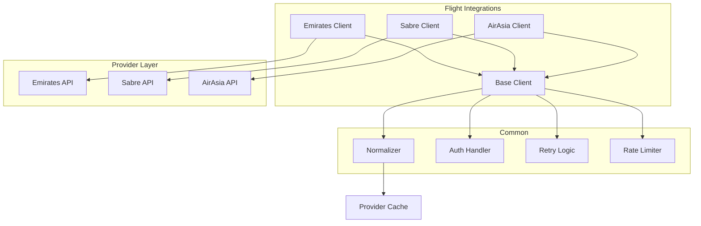

# Provider Integrations

Flight Shopping integrates with 400+ providers worldwide. This document explains how integrations work and how to add new ones.

## Provider Types

### Direct Airlines

Connect directly to airline APIs:

| Type | Examples | Characteristics |
|------|----------|-----------------|
| **NDC** | Singapore Airlines, Lufthansa | Modern API, rich content |
| **Proprietary** | Emirates, Qatar | Custom API formats |
| **Low-cost** | AirAsia, Scoot | Simpler, limited features |

### GDS (Global Distribution Systems)

Aggregators providing access to multiple airlines:

| GDS | Coverage | Notes |
|-----|----------|-------|
| **Sabre** | Global | Largest network |
| **Amadeus** | Strong in Europe | Rich content |
| **Travelport** | Galileo, Apollo | Good for US |

### OTAs (Online Travel Agencies)

Third-party booking platforms:

| Type | Examples |
|------|----------|
| **Global OTAs** | Expedia, Booking.com |
| **Regional OTAs** | MakeMyTrip (India), Traveloka (SEA) |
| **Consolidators** | BudgetAir, CheapOair |

### Aggregators

Meta-aggregators providing bulk data:

| Provider | Use Case |
|----------|----------|
| **Atlas** | External fare cache |
| **Skyscanner** | Comparison data |

## Integration Architecture



## Provider Client Structure

Each provider integration follows a common pattern:

```
flights/
└── emirates.com/
    ├── src/
    │   └── main/java/wego/integration/emirates/
    │       ├── EmiratesSearchClient.java      # Main client
    │       ├── EmiratesRequestTransformer.java # Request mapping
    │       ├── EmiratesResponseParser.java     # Response parsing
    │       ├── EmiratesConfig.java             # Configuration
    │       └── model/
    │           ├── EmiratesRequest.java
    │           └── EmiratesResponse.java
    ├── src/test/
    │   └── ...                                 # Tests
    └── build.gradle
```

### Key Components

<AccordionGroup>
  <Accordion title="Search Client">
    Main entry point for searches:
    
    ```java
    public class EmiratesSearchClient extends BaseSearchClient {
        
        @Override
        public ProviderResponse search(SearchRequest request) {
            // 1. Transform request
            EmiratesRequest emiratesReq = transformer.transform(request);
            
            // 2. Call API with retry
            EmiratesResponse response = withRetry(() -> 
                api.search(emiratesReq)
            );
            
            // 3. Parse and normalize
            return parser.parse(response);
        }
    }
    ```
  </Accordion>
  
  <Accordion title="Request Transformer">
    Maps common format to provider format:
    
    ```java
    public class EmiratesRequestTransformer {
        
        public EmiratesRequest transform(SearchRequest req) {
            return EmiratesRequest.builder()
                .origin(req.getOriginCode())
                .destination(req.getDestinationCode())
                .departureDate(formatDate(req.getDepartureDate()))
                .passengers(mapPassengers(req.getPassengers()))
                .cabinClass(mapCabin(req.getCabinClass()))
                .build();
        }
    }
    ```
  </Accordion>
  
  <Accordion title="Response Parser">
    Normalizes provider response:
    
    ```java
    public class EmiratesResponseParser {
        
        public ProviderResponse parse(EmiratesResponse resp) {
            List<Fare> fares = resp.getOffers().stream()
                .map(this::toFare)
                .collect(toList());
            
            return ProviderResponse.builder()
                .providerId("emirates.com")
                .fares(fares)
                .build();
        }
    }
    ```
  </Accordion>
</AccordionGroup>

## Adding a New Provider

<Steps>
  <Step title="Create Module">
    Generate from archetype:
    ```bash
    cd flight-integrations
    ./gradlew createProvider -Pname=newairline.com
    ```
  </Step>
  
  <Step title="Implement Client">
    1. Create request/response models
    2. Implement transformer
    3. Implement parser
    4. Extend `BaseSearchClient`
  </Step>
  
  <Step title="Configure">
    Add provider config to Static Redis:
    ```json
    {
      "id": "newairline.com",
      "name": "New Airline",
      "enabled": true,
      "routes": ["SIN-BKK", "SIN-KUL"],
      "markets": ["SG", "MY"],
      "credentials": "secret:newairline-creds"
    }
    ```
  </Step>
  
  <Step title="Test">
    1. Unit tests for transformer/parser
    2. Integration tests against sandbox
    3. Staging validation
    4. Production rollout
  </Step>
</Steps>

## Provider Configuration

### Static Redis Config

```json
{
  "id": "emirates.com",
  "name": "Emirates",
  "type": "direct_airline",
  "enabled": true,
  "priority": 100,
  "routes": {
    "include": ["*-DXB", "DXB-*"],
    "exclude": []
  },
  "markets": ["AE", "SG", "IN", "UK"],
  "rateLimit": {
    "qps": 50,
    "burst": 100
  },
  "timeout": {
    "connect": 5000,
    "read": 30000
  },
  "credentials": {
    "secretName": "emirates-api-creds"
  }
}
```

### Credentials Management

Credentials are stored in AWS Secrets Manager:

```json
// Secret: emirates-api-creds
{
  "apiKey": "xxx",
  "apiSecret": "xxx",
  "environment": "production"
}
```

## Common Patterns

### Error Handling

```java
public ProviderResponse search(SearchRequest request) {
    try {
        return doSearch(request);
    } catch (TimeoutException e) {
        metrics.increment("provider.timeout", tags);
        throw new ProviderTimeoutException(providerId, e);
    } catch (RateLimitException e) {
        metrics.increment("provider.rate_limited", tags);
        throw e;
    } catch (Exception e) {
        metrics.increment("provider.error", tags);
        throw new ProviderException(providerId, e);
    }
}
```

### Rate Limiting

```java
@Override
public ProviderResponse search(SearchRequest request) {
    if (!rateLimiter.tryAcquire()) {
        throw new RateLimitException(providerId);
    }
    return doSearch(request);
}
```

### Retry Logic

```java
private <T> T withRetry(Supplier<T> action) {
    return Retryer.builder()
        .maxAttempts(3)
        .backoff(exponential(100, 2000))
        .retryOn(TransientException.class)
        .build()
        .run(action);
}
```

## Monitoring Providers

### Key Metrics

| Metric | Description |
|--------|-------------|
| `provider.request.count` | Total requests |
| `provider.request.latency` | Response time |
| `provider.request.success` | Successful responses |
| `provider.request.error` | Error responses |
| `provider.request.timeout` | Timeouts |

### Provider Health

```sql
-- Check provider health in last hour
SELECT 
  provider,
  COUNT(*) as total,
  SUM(CASE WHEN status = 'success' THEN 1 ELSE 0 END) as success,
  AVG(latency_ms) as avg_latency
FROM provider_requests
WHERE timestamp > NOW() - INTERVAL 1 HOUR
GROUP BY provider
ORDER BY success / total ASC
```

## Provider SLAs

| Metric | Target | Action if Breached |
|--------|--------|-------------------|
| Success rate | >95% | Investigate, maybe disable |
| Latency p50 | <2s | Optimize or timeout |
| Latency p99 | <10s | Set lower timeout |
| Data quality | >99% | Fix parsing, report to provider |
