# Search Flow

This document details how a flight search request flows through the system, from initial user input to displaying results.

## High-Level Flow

```mermaid
sequenceDiagram
    participant User
    participant Frontend
    participant Curiosity
    participant MQ as Message Queue
    participant FI as Flight Integrations
    participant ProviderAPI as Provider APIs
    participant ProviderRedis
    participant LiveRedis
    participant StaticRedis

    Note over Curiosity,StaticRedis: Startup: Load provider configs
    StaticRedis->>Curiosity: Provider configurations

    User->>Frontend: Enter search (SIN→BKK, dates)
    Frontend->>Curiosity: POST /v3/metasearch/flights/searches
    
    Curiosity->>Curiosity: Validate request
    Curiosity->>StaticRedis: Get route/provider metadata
    Curiosity->>Curiosity: Calculate applicable providers
    Curiosity->>LiveRedis: Create search session
    
    loop For each provider
        Curiosity->>MQ: Publish search message
    end
    
    Curiosity-->>Frontend: Return search ID
    
    par Provider calls (parallel)
        MQ->>FI: Consume search message
        FI->>ProviderAPI: Call provider API
        ProviderAPI-->>FI: Raw fare response
        FI->>FI: Normalize to common format
        FI->>ProviderRedis: Store provider fares
        FI->>MQ: Publish completion message
    end
    
    MQ->>Curiosity: Completion message
    Curiosity->>ProviderRedis: Get provider fares
    Curiosity->>Curiosity: Transform & aggregate
    Curiosity->>LiveRedis: Store live fares

    loop Polling
        Frontend->>Curiosity: GET /searches/:id (poll)
        Curiosity->>LiveRedis: Get current results
        Curiosity-->>Frontend: Partial results
    end
    
    Frontend-->>User: Display flight options
```



## Request Processing

### 1. Search Initiation

When a search request arrives at Curiosity:

```json
POST /v3/metasearch/flights/searches
{
  "trips": [{
    "departureCode": "SIN",
    "arrivalCode": "BKK",
    "outboundDate": "2025-03-15"
  }],
  "adults": 1,
  "children": 0,
  "infants": 0,
  "cabinClass": "economy",
  "siteCode": "SG"
}
```

### 2. Validation & Enrichment

Curiosity validates and enriches the request:

| Check | Action |
|-------|--------|
| **Route validity** | Verify airports exist, route is searchable |
| **Date validity** | Check dates are in future, within limits |
| **Passenger rules** | Validate passenger counts |
| **Enrichment** | Add city codes, country codes, timezone info |

### 3. Provider Selection

The system determines which providers to query based on:

- **Route coverage**: Does provider serve this route?
- **Market rules**: Provider enabled for this site/country?
- **Capacity**: Is provider within rate limits?
- **Priority**: Provider ranking for this route

```java
// Simplified provider selection logic
List<Provider> providers = staticData.getProvidersForRoute(route)
    .filter(p -> p.isEnabledForMarket(siteCode))
    .filter(p -> rateLimiter.hasCapacity(p))
    .sortByPriority();
```

### 4. Message Queue Distribution

Search requests are published to message queues:

```
Queue: flights-search-requests
Message: {
  searchId: "abc123",
  provider: "emirates.com",
  route: { from: "SIN", to: "BKK" },
  dates: { outbound: "2025-03-15" },
  passengers: { adults: 1 }
}
```

## Provider Processing

### 5. Integration Worker

Flight Integrations workers consume messages:

```java
// Each provider has a specific implementation
public class EmiratesSearchClient extends BaseSearchClient {
    
    public ProviderResponse search(SearchRequest request) {
        // Transform to Emirates API format
        EmiratesRequest emiratesReq = transform(request);
        
        // Call Emirates API
        EmiratesResponse response = api.search(emiratesReq);
        
        // Normalize to common format
        return normalize(response);
    }
}
```

### 6. Response Normalization

Provider responses are normalized to a common format:

```json
{
  "providerId": "emirates.com",
  "fares": [{
    "price": { "amount": 350.00, "currency": "SGD" },
    "legs": [{
      "departureTime": "2025-03-15T08:00:00",
      "arrivalTime": "2025-03-15T10:30:00",
      "airline": "EK",
      "flightNumber": "EK352",
      "aircraft": "A380"
    }],
    "deeplink": "https://emirates.com/book/..."
  }]
}
```

### 7. Provider Cache Storage

Fares are stored in Provider Redis:

```
Key: provider:emirates.com:SIN:BKK:2025-03-15
TTL: 300 seconds (5 minutes)
Value: [normalized fares]
```

## Result Aggregation

### 8. Completion Processing

When provider completes, Curiosity:

1. Reads fares from Provider Redis
2. Transforms to live format
3. Deduplicates across providers
4. Ranks and sorts results
5. Stores in Live Redis

### 9. Live Cache Structure

```
Key: live:search:abc123
TTL: 900 seconds (15 minutes)

Structure:
- search: { metadata, status, providers }
- flights: [ { legs, segments } ]
- fares: [ { price, provider, deeplink } ]
```

## Polling & Response

### 10. Progressive Results

Frontend polls for results:

```
GET /v3/metasearch/flights/searches/abc123

Response:
{
  "id": "abc123",
  "status": "in_progress",
  "progress": 0.65,  // 65% of providers responded
  "flights": [...],
  "fares": [...]
}
```

### 11. Completion

When all providers respond (or timeout):

```json
{
  "id": "abc123",
  "status": "completed",
  "progress": 1.0,
  "flights": [...],   // 50+ unique flights
  "fares": [...],     // 200+ fare options
  "metadata": {
    "providers": {
      "total": 15,
      "succeeded": 14,
      "failed": 1
    }
  }
}
```

## Timing Breakdown

| Phase | Target | Notes |
|-------|--------|-------|
| Request validation | <50ms | Local processing |
| Provider selection | <100ms | Static Redis lookup |
| Queue publish | <50ms | Async |
| Provider API call | 1-5s | Depends on provider |
| Response processing | <200ms | Per provider |
| First results | <3s | User sees initial results |
| Complete results | <15s | All providers finished |

## Error Handling

### Provider Failures

| Scenario | Handling |
|----------|----------|
| Timeout | Log, mark failed, continue with others |
| API error | Retry once, then mark failed |
| Invalid response | Log, skip, continue |
| Rate limited | Back off, try later |

### Search Failures

| Scenario | Handling |
|----------|----------|
| Invalid request | Return 400 with details |
| No providers | Return empty results |
| All providers fail | Return partial/cached results |
| System overload | Return 503, retry later |
