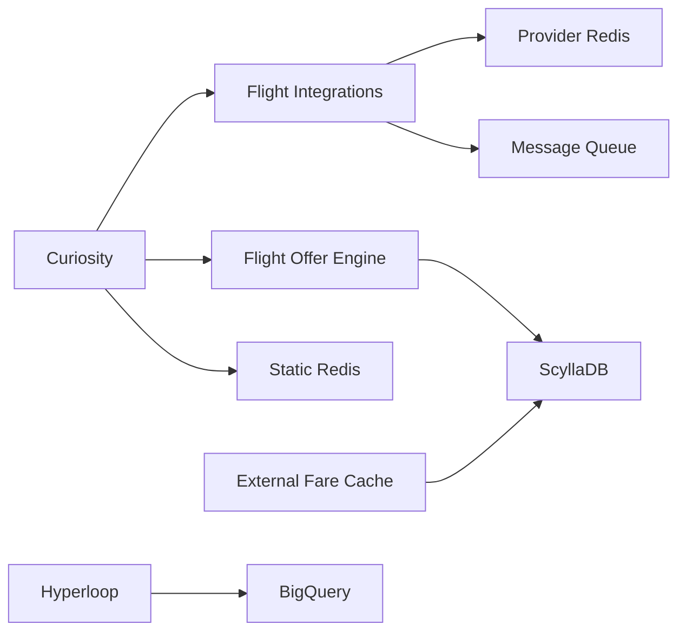

# Services

This page documents each service in the Flight Shopping ecosystem.

## Curiosity

**The main search orchestrator** - handles all flight search requests and coordinates the search flow.

<Info>
Repository: [github.com/wego/curiosity](https://github.com/wego/curiosity)
</Info>

### Purpose

- Entry point for flight searches
- Orchestrates provider queries
- Aggregates and transforms results
- Manages search lifecycle

### Key Components

| Class | Responsibility |
|-------|----------------|
| `CuriosityApplication` | Application entry point |
| `SearchResourceV3` | Search and polling endpoints |
| `SearchService` | Search business logic |
| `IntegrationManagerService` | Loads provider configurations |
| `SearchCompletedEventService` | Processes provider responses |
| `ProviderManagerSearchRequestSubscriber` | Metasearch provider listener |
| `BowProviderManagerSearchRequestSubscriber` | BOW (Book on Wego) listener |

### API Endpoints

| Endpoint | Purpose |
|----------|---------|
| `POST /v3/metasearch/flights/searches` | Initiate search |
| `GET /v3/metasearch/flights/searches/:id` | Poll results |
| `GET /v5/metasearch/flights/:id` | Get flight details |
| `GET /v3/metasearch/flights/fares/:id` | Get fare details |
| `GET /heartbeat` | Health check |

### Configuration

Key configuration in `dropwizard.yml`:

```yaml
# Redis connections
liveRedis:
  host: localhost
  port: 7001

staticRedis:
  host: localhost
  port: 6480

# Message queue
messageQueue:
  host: localhost
  port: 9324
```

### Running Locally

```bash
# Start dependencies
docker-compose up -d live-redis static-redis elasticmq

# Build
./gradlew clean build -x test

# Run
java -Dwego.environment=staging \
     -Djetty.home=providers \
     -Dwego.applicationType=ALL \
     wego.curiosity.CuriosityApplication \
     server curiosity-providers/dropwizard.yml
```

---

## Flight Integrations

**Provider integration layer** - contains the code for connecting to 400+ airlines and OTAs.

<Info>
Repository: [github.com/wego/flight-integrations](https://github.com/wego/flight-integrations)
</Info>

### Purpose

- Implement provider-specific API clients
- Transform provider responses to common format
- Handle provider-specific error cases
- Manage credentials and rate limiting

### Structure

```
flight-integrations/
├── flights/
│   ├── emirates.com/      # Emirates integration
│   ├── sabre.com/         # Sabre GDS
│   ├── amadeus.com/       # Amadeus GDS
│   └── ...                # 400+ providers
├── provider/              # Common provider utilities
└── config/                # Provider configurations
```

### Adding a New Provider

<Steps>
  <Step title="Create module">
    Use the archetype in `provider-archetype-flights`
  </Step>
  <Step title="Implement client">
    Create API client extending base classes
  </Step>
  <Step title="Transform responses">
    Map to common fare format
  </Step>
  <Step title="Configure">
    Add to provider configs in Static Redis
  </Step>
  <Step title="Test">
    Integration tests against staging/sandbox
  </Step>
</Steps>

### Configuration

In `local.properties`:
```properties
integrationType=flights
includedIntegration=sabre.com,emirates.com
```

---

## Flight Offer Engine

**Offer processing and caching** - handles fare processing, caching, and serving.

<Info>
Repository: [github.com/wego/flight-offer-engine](https://github.com/wego/flight-offer-engine)
</Info>

### Purpose

- Process and normalize fares
- Store in ScyllaDB for fast retrieval
- Serve cached offers to search
- Handle offer revalidation

### Tech Stack

- Spring Boot 3.x
- GraalVM 21
- ScyllaDB
- LocalStack (local development)

### Running Locally

```bash
# Start infrastructure
./run_infra_local.sh

# Build
./gradlew clean build

# Run with debug
docker-compose -f docker-compose.debug.yml up -d
```

---

## External Fare Cache

**Partner data ingestion** - fetches and caches fares from external partners like Atlas.

<Info>
Repository: [github.com/wego/flight-external-fare-cache](https://github.com/wego/flight-external-fare-cache)
</Info>

### Purpose

- Fetch bulk fare data from partners
- Process and store in cache
- Serve to GFS and other consumers
- Track data freshness and quality

### Key Endpoints

| Endpoint | Purpose |
|----------|---------|
| `GET /heartbeat` | Health check |
| `POST /v1/atlas/fetch` | Trigger Atlas data fetch |

### Triggered By

- Airflow scheduled jobs
- Manual API calls for refresh

---

## Supporting Services

### Flight Services

Static data management - airlines, airports, routes.

```bash
# Repository
github.com/wego/flight-services
```

### Flight Offer Aggregator

Result aggregation and deduplication.

```bash
# Repository
github.com/wego/flight-offer-aggregator
```

### Hyperloop

Data pipeline and ETL jobs.

```bash
# Repository
github.com/wego/hyperloop
```

Used for syncing data to BigQuery for analytics.

---

## Service Dependencies



## Ports Reference

| Service | Default Port | Debug Port |
|---------|--------------|------------|
| Curiosity | 8080 | 5005 |
| Flight Integrations | 8081 | 5006 |
| Flight Offer Engine | 8082 | 5005 |
| Live Redis | 7001 | - |
| Static Redis | 6480 | - |
| ElasticMQ | 9324 | - |
| ScyllaDB | 9042 | - |
