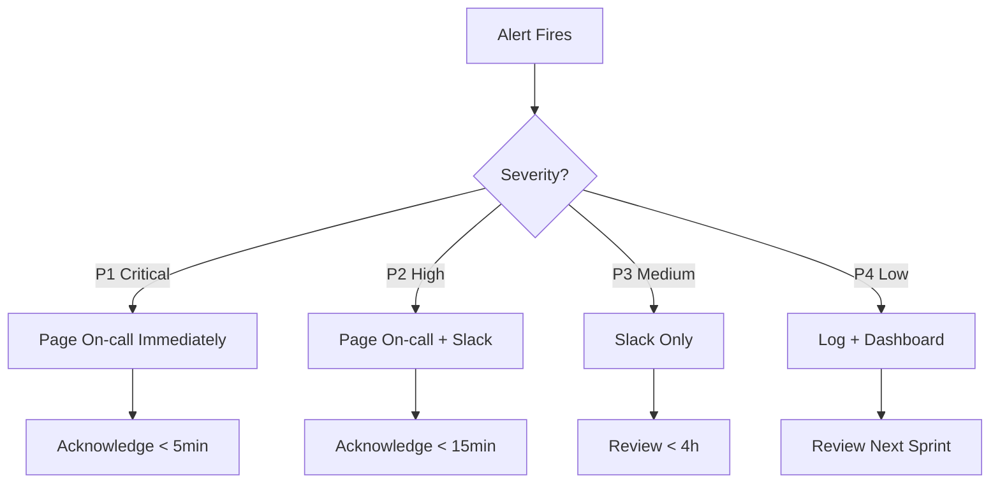

# Alerts

This document covers our alert configuration, escalation paths, and response procedures.

## Alert Hierarchy



## Alert Definitions

### P1 - Critical

<Warning>
Immediate response required. Page on-call, all hands if needed.
</Warning>

| Alert | Condition | Impact |
|-------|-----------|--------|
| **GFS Complete Outage** | 0 TPS for 2+ min | Partner SLA breach |
| **Search Complete Outage** | 0 TPS for 2+ min | No user searches |
| **Redis Cluster Down** | All nodes unreachable | System failure |
| **Database Down** | ScyllaDB unreachable | Data unavailable |

**Response**:
1. Acknowledge in PagerDuty
2. Join war room (if escalated)
3. Identify root cause
4. Mitigate (rollback, failover, restart)
5. Resolve and notify stakeholders

---

### P2 - High

<Tip>
Urgent but not complete outage. Respond within 15-30 minutes.
</Tip>

| Alert | Condition | Impact |
|-------|-----------|--------|
| **GFS Latency High** | P95 > 1s for 5min | SLA at risk |
| **Error Rate High** | >5% for 5min | User experience degraded |
| **Search Latency High** | P95 > 5s for 5min | Slow searches |
| **Cache Hit Rate Low** | <50% for 15min | Performance degraded |

**Response**:
1. Acknowledge alert
2. Check dashboard for context
3. Investigate root cause
4. Apply fix or escalate
5. Document in Slack

---

### P3 - Medium

| Alert | Condition | Impact |
|-------|-----------|--------|
| **Provider Down** | Single provider 0% success | Reduced coverage |
| **Memory High** | >85% for 30min | Performance risk |
| **CPU High** | >85% for 30min | Performance risk |
| **Queue Backlog** | >1000 messages | Delayed processing |

**Response**:
1. Review during working hours
2. Create ticket if persistent
3. Fix in current sprint

---

### P4 - Low

| Alert | Condition | Impact |
|-------|-----------|--------|
| **Provider Slow** | Latency > 10s | Minor slowdown |
| **Log Errors Elevated** | >100/min | Potential issue |
| **Disk Usage High** | >70% | Future risk |

**Response**:
1. Log for awareness
2. Review in next planning
3. Address as tech debt

---

## Alert Configuration

### Datadog Monitors

```yaml
# GFS Latency Alert
name: "[P2] GFS Latency P95 > 1s"
type: metric alert
query: "avg(last_5m):p95:gfs.latency{*} > 1000"
message: |
  GFS latency is elevated.
  
  **Impact**: Google Flights SLA at risk
  **Runbook**: /runbooks/performance-issues
  
  @slack-flights-dev-internal
  @pagerduty-flights-oncall
thresholds:
  critical: 1000
  warning: 500

# Error Rate Alert
name: "[P2] Search Error Rate > 5%"
type: metric alert
query: |
  avg(last_5m):
    sum:curiosity.errors{*}.as_count() / 
    sum:curiosity.requests{*}.as_count() * 100 > 5
message: |
  Search error rate is high.
  
  **Impact**: Users seeing errors
  **Runbook**: /runbooks/search-issues
  
  @slack-flights-dev-internal
  @pagerduty-flights-oncall
thresholds:
  critical: 5
  warning: 2
```

### PagerDuty Integration

- **Service**: Flight Shopping
- **Escalation Policy**: On-call → Secondary → Team Lead
- **Escalation Timeout**: 10 minutes per level

### Slack Integration

| Channel | Alert Types |
|---------|-------------|
| `#flights-dev-internal` | P2, P3 alerts |
| `#tech-oncall` | P1 alerts, escalations |
| `#flights-alerts` | All alerts (archive) |

---

## On-Call Responsibilities

### Primary On-Call

1. **Acknowledge** all pages within 5 min (P1) or 15 min (P2)
2. **Investigate** and identify root cause
3. **Mitigate** - fix, rollback, or escalate
4. **Communicate** - updates in Slack
5. **Document** - post-incident notes

### Secondary On-Call

1. **Backup** for complex issues
2. **Available** for escalation
3. **Support** primary as needed

### Escalation Path

```
Primary On-Call (10 min)
    ↓
Secondary On-Call (10 min)
    ↓
Team Lead (Tin)
    ↓
Engineering Manager
```

---

## Alert Suppression

### Maintenance Windows

During planned maintenance:

```bash
# Suppress alerts in Datadog
# Go to Monitors → Manage Downtime → Schedule Downtime
```

### False Positive Handling

If alert is a false positive:

1. **Do not ignore** - investigate anyway
2. **Document** why it was false positive
3. **Tune** alert threshold if needed
4. **Create ticket** for alert improvement

---

## Best Practices

<AccordionGroup>
  <Accordion title="Alert Fatigue Prevention">
    - Only alert on actionable conditions
    - Set appropriate thresholds (not too sensitive)
    - Group related alerts
    - Remove obsolete alerts
    - Review alert volume weekly
  </Accordion>
  
  <Accordion title="Alert Naming">
    - Include severity: `[P1]`, `[P2]`, etc.
    - Be specific: What, not why
    - Include service: `[GFS]`, `[Curiosity]`
    
    Good: `[P2][GFS] Latency P95 > 1s`
    Bad: `Something is slow`
  </Accordion>
  
  <Accordion title="Alert Messages">
    Include in every alert:
    - What is happening
    - Impact on users/business
    - Link to runbook
    - Notification channels
  </Accordion>
</AccordionGroup>

---

## Quick Reference

| Severity | Response Time | Page | Slack | Example |
|----------|---------------|------|-------|---------|
| P1 | <5 min | Yes | Yes | Complete outage |
| P2 | <15 min | Yes | Yes | High errors |
| P3 | <4 hours | No | Yes | Provider down |
| P4 | Next sprint | No | No | Minor issue |
