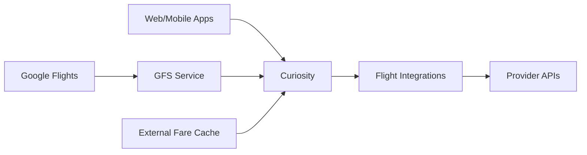

# Flight Shopping Product Overview

Flight Shopping is Wego's core flight metasearch capability. We aggregate flight prices and availability from hundreds of providers worldwide, enabling users to compare and book flights at the best prices.

## What We Do

<CardGroup cols={2}>
  <Card title="Aggregate Prices" icon="dollar-sign">
    Pull real-time fares from 400+ airlines, OTAs, and travel agents
  </Card>
  <Card title="Compare & Sort" icon="filter">
    Present the best options based on price, duration, stops, and more
  </Card>
  <Card title="Enable Booking" icon="credit-card">
    Direct users to providers for seamless booking handoff
  </Card>
  <Card title="Power Partnerships" icon="handshake">
    Provide flight data to partners like Google Flights
  </Card>
</CardGroup>

## Key Features

### Real-time Search

When a user searches for flights on Wego, our system:
1. Receives the search request (origin, destination, dates, passengers)
2. Fans out queries to relevant providers in parallel
3. Normalizes responses into a unified format
4. Aggregates and deduplicates results
5. Presents sorted results to the user within seconds

### Fare Caching

For instant results and better UX, we maintain several cache layers:

| Cache Type | Purpose | TTL |
|------------|---------|-----|
| **Live Cache** | Real-time search results | Minutes |
| **Provider Cache** | Raw provider responses | Minutes |
| **External Fare Cache** | Pre-fetched partner data (Atlas, GFS) | Hours |
| **Static Data** | Airlines, airports, routes | Days |

### Google Flights Integration (GFS)

One of our most important partnerships. Google Flights displays Wego's fares to millions of users:

- **Inbound**: Google sends fare requests, we respond with cached or live data
- **Performance Critical**: Strict latency and accuracy requirements
- **Revenue Driver**: Significant portion of flight traffic comes from GFS

<Info>
The GFS dashboard at [Datadog](https://app.datadoghq.com/dashboard/mdz-52s-9w3/google-flights-gfs) is essential for monitoring this partnership.
</Info>

## Business Metrics

### What We Optimize For

1. **Search TPS** - Transactions per second handled
2. **Latency** - Time to first result, time to complete
3. **Coverage** - % of searches with at least one fare
4. **Price Accuracy** - Match between displayed and actual booking price
5. **Provider Success Rate** - % of provider calls returning valid results

### Revenue Model

Wego operates on a **CPC (cost per click)** model:
- Users search on Wego (free)
- Users click through to provider sites
- Providers pay Wego for the referral

This means:
- More searches = more opportunities
- Better prices = more clicks
- Faster results = better UX = more engagement

## Market Coverage

Flight Shopping supports:

- **50+ countries** with localized content
- **Multiple currencies** with real-time conversion
- **400+ providers** including:
  - Full-service airlines (Emirates, Singapore Airlines, etc.)
  - Low-cost carriers (AirAsia, Scoot, etc.)
  - OTAs (Expedia, Booking.com, etc.)
  - Regional agencies and consolidators

## Integration Points

### Upstream (Traffic Sources)
- Wego web and mobile apps
- Google Flights (GFS)
- Affiliate partners

### Downstream (Data Sources)
- Airline direct APIs (NDC, proprietary)
- GDS systems (Sabre, Amadeus, Travelport)
- OTA APIs
- Aggregator partners (Atlas)
