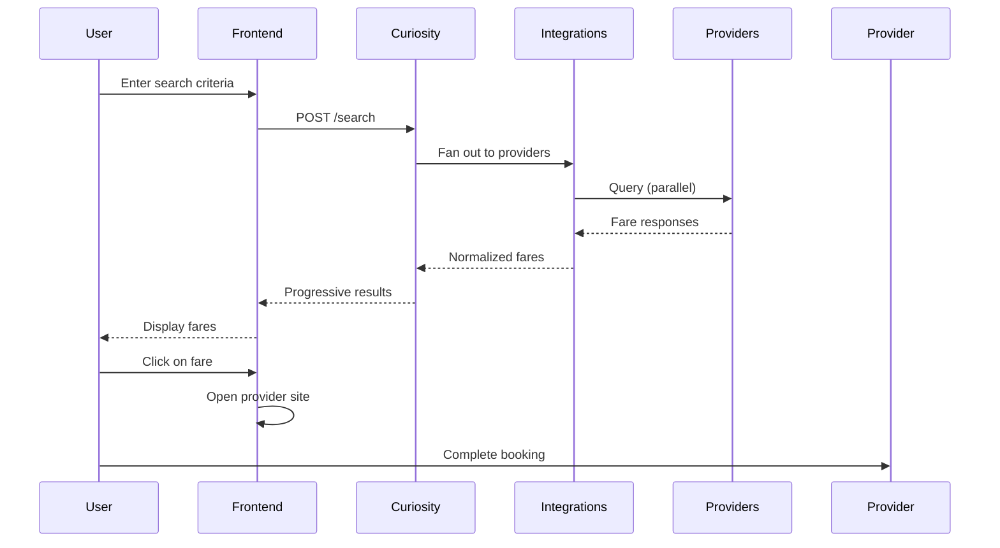
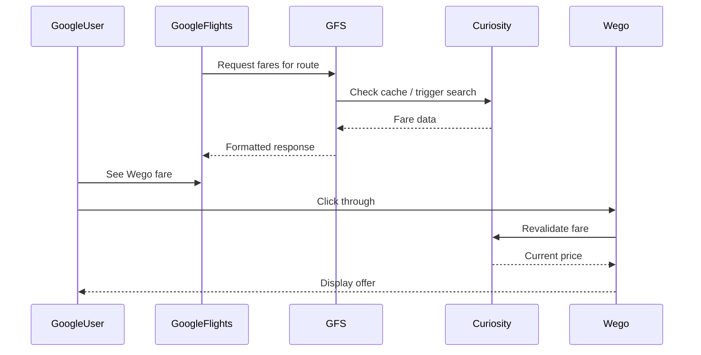
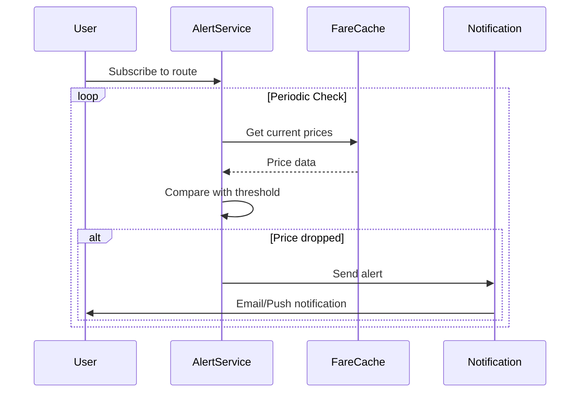

# User Journeys

Understanding the user journeys helps us design better systems and identify critical paths that need to be highly available and performant.

## Primary Journeys

### 1. Flight Search & Book (Core Flow)

This is the bread and butter of Flight Shopping.



**Critical metrics for this journey:**
- Time to first result: <3 seconds
- Search completion: <15 seconds
- Coverage: >90% of searches have results

### 2. Google Flights Click-through

When users discover flights via Google and click through to Wego.



**Critical metrics:**
- GFS response latency: <500ms (p95)
- Price accuracy: <5% variance from booking price
- Cache hit rate: >80%

### 3. Price Alerts (Async)

Users subscribe to price changes for specific routes.



## User Types & Needs

### Price-Sensitive Travelers

- **Behavior**: Multiple searches, compare extensively, flexible dates
- **Needs**: Cheapest options, flexible date views, price history
- **Our focus**: Broad provider coverage, accurate lowest prices

### Business Travelers

- **Behavior**: Specific dates, prefer direct flights, book quickly
- **Needs**: Schedule, loyalty programs, flexibility to change
- **Our focus**: Fast results, quality airlines, fare classes

### Spontaneous Bookers

- **Behavior**: Quick decisions, mobile-first, near-term dates
- **Needs**: Speed, simplicity, trust signals
- **Our focus**: Fast search, clean UI, provider ratings

## Critical Path Analysis

### Must-Not-Fail Components

| Component | Impact if Down | Recovery Time Target |
|-----------|----------------|---------------------|
| Curiosity | All searches fail | <5 minutes |
| Redis Cluster | No results returned | <5 minutes |
| Static Data | Searches degrade | <15 minutes |
| GFS | Partner revenue lost | <5 minutes |

### Graceful Degradation

When components fail, we degrade gracefully:

1. **Single provider down** → Other providers still return results
2. **Cache miss** → Fall back to live search (slower)
3. **Static data stale** → Use cached version (may miss new data)
4. **GFS overload** → Rate limit, serve from cache

## Conversion Funnel

```
Search Initiated     100%
    │
    ▼
Results Displayed     95%  ← Target: >95%
    │
    ▼
Fare Clicked          15%  ← Depends on pricing/UX
    │
    ▼
Handoff to Provider   14%  ← Minimal drop expected
    │
    ▼
Booking Completed     ~3%  ← Provider's responsibility
```

**We optimize for:**
- High search success rate (get results)
- Good fare quality (users find what they want)
- Smooth handoff (users reach provider successfully)
