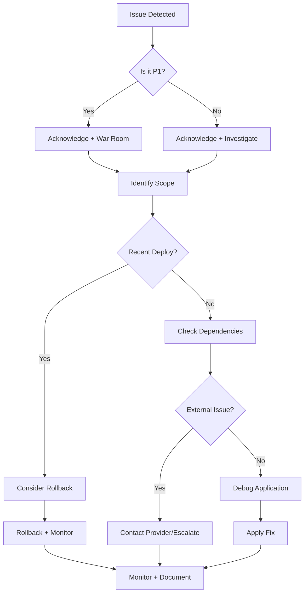

# Runbooks Overview

This section contains runbooks for diagnosing and resolving common issues in Flight Shopping systems.

## Quick Reference

| Issue Type | Runbook | Common Causes |
|------------|---------|---------------|
| Searches failing | [Search Issues](/runbooks/search-issues) | Redis down, provider failures |
| Single provider down | [Provider Issues](/runbooks/provider-issues) | API changes, rate limiting, auth |
| Slow responses | [Performance Issues](/runbooks/performance-issues) | Cache miss, DB slow, high load |

## Before You Start

<Steps>
  <Step title="Check Dashboards">
    Open the relevant dashboard to understand the scope of the issue.
    
    - [GFS Dashboard](https://app.datadoghq.com/dashboard/mdz-52s-9w3/google-flights-gfs)
  </Step>
  
  <Step title="Check Recent Deployments">
    ```bash
    # Check recent deployments in Jenkins
    # Or check git log for recent changes
    git log --oneline -10
    ```
  </Step>
  
  <Step title="Check for Known Issues">
    - Check `#flights-dev-internal` for ongoing discussions
    - Check PagerDuty for related alerts
  </Step>
</Steps>

## General Troubleshooting Flow



## Escalation

If you can't resolve an issue:

1. **Document** what you've tried
2. **Escalate** to secondary on-call or team lead
3. **Keep communicating** in Slack

## Post-Incident

After resolving P1/P2 incidents:

1. **Create post-mortem** document
2. **Identify** root cause
3. **Create tickets** for follow-up improvements
4. **Share learnings** with team
