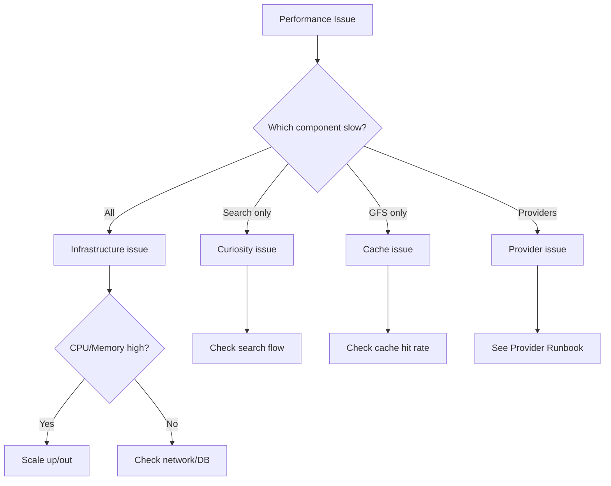

# Performance Issues Runbook

Use this runbook when experiencing slow responses, high latency, or performance degradation.

## Symptoms

- Search latency elevated (p50, p95, p99)
- GFS latency SLA at risk
- Timeout rates increasing
- Users complaining about slow results

## Quick Diagnosis



## Step 1: Identify Bottleneck

### Check latency breakdown

In Datadog APM, check trace waterfall for slow requests:

1. Go to APM → Services → Curiosity
2. Find slow traces
3. Identify slowest spans

### Common bottlenecks

| Component | Check | Healthy |
|-----------|-------|---------|
| Redis (Live) | `redis.latency.p99` | <5ms |
| Redis (Static) | `redis.latency.p99` | <5ms |
| Provider calls | `provider.latency.p99` | <10s |
| ScyllaDB | `scylladb.read_latency` | <10ms |
| CPU | `system.cpu.user` | <70% |
| Memory | `system.mem.used` | <85% |

## Step 2: Cache Issues

### Low cache hit rate

If cache hit rate dropped:

```bash
# Check cache stats
redis-cli -h live-redis INFO stats | grep hits

# Check for evictions
redis-cli -h live-redis INFO stats | grep evicted
```

<Accordion title="Fix: Cache warming">
If cache is cold (after restart or deployment):

1. Wait for natural warm-up (30-60 min)
2. Or trigger background refresh for popular routes
</Accordion>

<Accordion title="Fix: Increase cache capacity">
If evictions are high:

1. Check Redis memory usage
2. Request capacity increase
3. Or reduce TTL for low-priority data
</Accordion>

### Cache connection issues

```bash
# Check connection pool
redis-cli -h live-redis CLIENT LIST | wc -l

# If too many connections, check for leaks
```

## Step 3: Database Issues

### ScyllaDB slow

```bash
# Check read latency
nodetool tablehistograms flight_cache.fares

# Check compaction status
nodetool compactionstats
```

<Accordion title="Fix: Compaction backlog">
If compaction is behind:

1. Monitor compaction progress
2. Consider manual compaction during low traffic
3. May need to temporarily reduce write load
</Accordion>

## Step 4: Application Issues

### High CPU usage

```bash
# Check Curiosity CPU
kubectl top pods -l app=curiosity

# If high, check for:
# - Hot loops
# - Inefficient queries
# - Memory pressure causing GC
```

<Accordion title="Fix: Scale out">
```bash
# Increase replica count
kubectl scale deployment/curiosity --replicas=15

# Monitor improvement
```
</Accordion>

### Memory pressure

```bash
# Check memory and GC
kubectl logs -l app=curiosity | grep -i "gc\|memory\|heap"
```

<Accordion title="Fix: Increase memory or optimize">
1. Check for memory leaks
2. Increase pod memory limits
3. Tune JVM settings
</Accordion>

## Step 5: Provider Latency

If providers are slow:

1. Check individual provider latencies
2. Identify slowest providers
3. Consider:
   - Reducing timeout
   - Disabling very slow providers temporarily
   - Caching more aggressively

## Step 6: Quick Wins

### Immediate relief options

| Action | Impact | Risk |
|--------|--------|------|
| Scale out | More capacity | Low |
| Increase timeout | Fewer failures | May hide issues |
| Reduce provider set | Faster complete | Less coverage |
| Cache longer | More hits | Staler data |

## Monitoring Recovery

After applying fixes:

1. Watch latency metrics (p50, p95, p99)
2. Confirm error rate stable/improving
3. Monitor for 30+ minutes
4. Check GFS SLA metrics

## Prevention

- Regular capacity reviews
- Load testing before big launches
- Cache warming procedures
- Provider health monitoring
