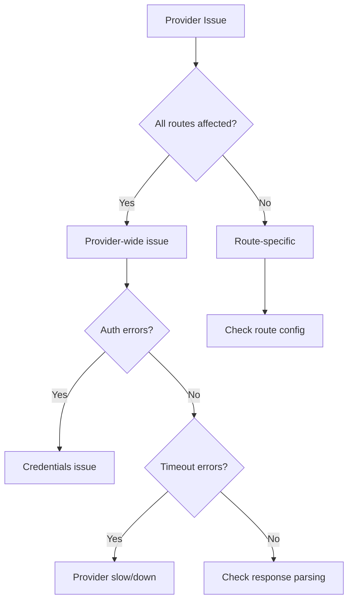

# Provider Issues Runbook

Use this runbook when a specific provider is failing or returning errors.

## Symptoms

- Single provider showing 0% success rate
- Provider-specific errors in logs
- Reduced fare coverage for certain routes
- Provider timeout rates elevated

## Quick Diagnosis



## Step 1: Identify the Provider

### Check provider metrics

In Datadog, filter by provider:

```
sum:provider.request.error{provider:emirates.com}
```

### Check recent logs

```bash
kubectl logs -l app=flight-integrations --tail=200 | grep "emirates" | grep -i error
```

## Step 2: Common Issues

### Authentication Failures

<Accordion title="Symptoms">
- 401/403 errors in logs
- "Unauthorized" or "Invalid credentials"
- Sudden failure after working fine
</Accordion>

<Accordion title="Fix: Refresh credentials">
1. Check if credentials expired
2. Verify in AWS Secrets Manager:
   ```bash
   aws secretsmanager get-secret-value --secret-id emirates-api-creds
   ```
3. Update if needed and restart service
</Accordion>

### Rate Limiting

<Accordion title="Symptoms">
- 429 errors
- "Rate limit exceeded"
- Partial success (some requests work)
</Accordion>

<Accordion title="Fix: Reduce request rate">
1. Check current rate limit config in Static Redis
2. Reduce `rateLimit.qps` temporarily
3. Contact provider if persistent
</Accordion>

### API Changes

<Accordion title="Symptoms">
- Parse errors in logs
- "Unexpected response format"
- Started after provider maintenance
</Accordion>

<Accordion title="Fix: Update integration">
1. Get sample response from provider
2. Compare with expected format
3. Update parser if format changed
4. Deploy fix
</Accordion>

### Provider Outage

<Accordion title="Symptoms">
- Connection refused
- DNS failures
- Provider status page shows issues
</Accordion>

<Accordion title="Fix: Wait or disable">
1. Check provider status page
2. If confirmed outage, disable provider temporarily:
   ```bash
   # In Static Redis, set enabled: false
   redis-cli -h static-redis SET "provider:emirates.com:enabled" "false"
   ```
3. Re-enable when provider recovers
</Accordion>

## Step 3: Provider-Specific Notes

### GDS Providers (Sabre, Amadeus)

- Check GDS status pages for maintenance
- Verify PCC/office codes are valid
- Session management issues common

### Airline Direct

- Check for API version changes
- Certificate expiry common
- Rate limits vary by endpoint

### OTAs

- Scraping-based integrations more fragile
- Site changes break integrations
- May need manual fix

## Step 4: Testing Provider

### Manual test

```bash
# Run provider search manually
curl -X POST http://flight-integrations:8081/test/search \
  -H "Content-Type: application/json" \
  -d '{
    "provider": "emirates.com",
    "route": {"from": "SIN", "to": "DXB"},
    "date": "2025-03-15"
  }'
```

### Check response

```bash
# Get cached provider response
redis-cli -h provider-redis GET "provider:emirates.com:SIN:DXB:2025-03-15"
```

## Step 5: Resolution

### Temporary disable

If provider is causing broader issues:

```bash
# Disable in Static Redis
redis-cli -h static-redis HSET "provider:emirates.com" "enabled" "false"

# Restart Curiosity to pick up change
kubectl rollout restart deployment/curiosity
```

### Permanent fix

1. Create JIRA ticket for fix
2. Implement and test
3. Deploy to staging
4. Verify fix
5. Deploy to production
6. Re-enable provider

## Escalation

For critical providers (GFS-related):
1. Escalate immediately
2. Consider partner notification
3. Track SLA impact
