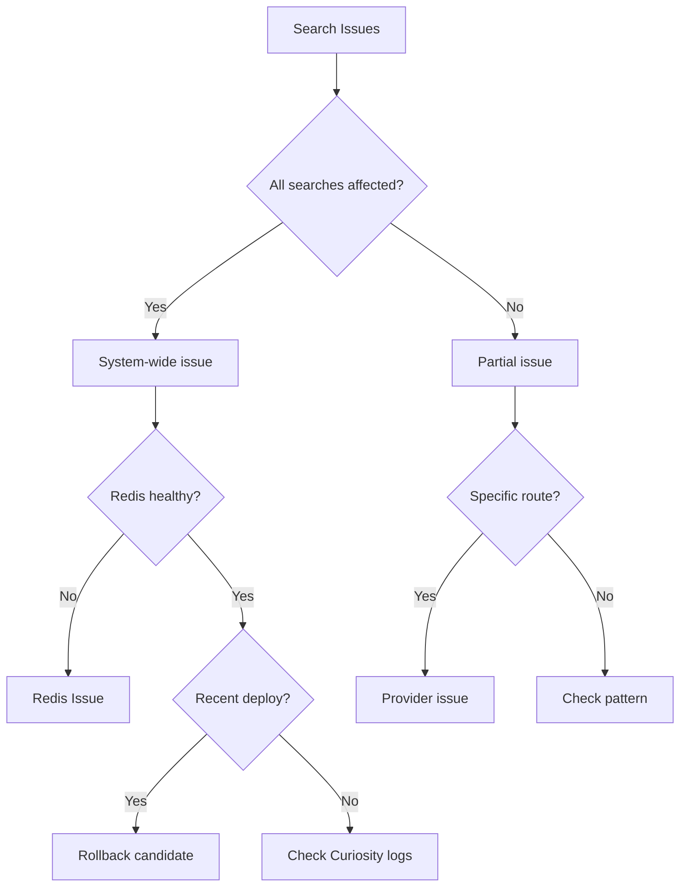

# Search Issues Runbook

Use this runbook when searches are failing or returning errors.

## Symptoms

- Users see "No results found" or error messages
- Search TPS dropped significantly
- High error rate in dashboards
- Timeout errors in logs

## Quick Diagnosis



## Step 1: Check System Health

### Redis Cluster

```bash
# Check Redis connectivity
redis-cli -h live-redis-host -p 7001 ping

# Check cluster health
redis-cli -h live-redis-host -p 7001 cluster info

# Check memory
redis-cli -h live-redis-host -p 7001 info memory
```

**Healthy indicators:**
- `cluster_state:ok`
- Memory usage < 85%
- No connection errors

### Curiosity Service

```bash
# Check health endpoint
curl -s http://curiosity:8080/heartbeat

# Check application logs
kubectl logs -l app=curiosity --tail=100 | grep ERROR
```

## Step 2: Identify Scope

### Check if route-specific

```bash
# Test specific search
curl -X POST http://curiosity:8080/v3/metasearch/flights/searches \
  -H "Content-Type: application/json" \
  -d '{"trips":[{"departureCode":"SIN","arrivalCode":"BKK","outboundDate":"2025-03-15"}],"adults":1}'
```

### Check provider responses

Look in Provider Redis for recent responses:

```bash
redis-cli -h provider-redis -p 6379 keys "provider:*:SIN:BKK:*" | head -5
```

## Step 3: Common Fixes

### Redis Connection Issues

<Accordion title="Fix: Restart Redis connections">
If Redis connections are stale:

```bash
# Restart Curiosity pods to refresh connections
kubectl rollout restart deployment/curiosity
```

Watch for service recovery in dashboard.
</Accordion>

### Message Queue Backup

<Accordion title="Fix: Clear message queue backlog">
If MQ is backed up:

```bash
# Check queue depth
aws sqs get-queue-attributes --queue-url $QUEUE_URL --attribute-names ApproximateNumberOfMessages

# If needed, scale up consumers
kubectl scale deployment/flight-integrations --replicas=10
```
</Accordion>

### Recent Bad Deploy

<Accordion title="Fix: Rollback deployment">
If issue started after deploy:

```bash
# Rollback to previous version
kubectl rollout undo deployment/curiosity

# Or in Jenkins: run previous successful build
```
</Accordion>

## Step 4: Monitor Recovery

After applying fix:

1. Watch dashboard for TPS recovery
2. Check error rate dropping
3. Verify sample searches work
4. Monitor for 15-30 minutes

## Escalation

If issue persists after trying above:

1. Page secondary on-call
2. Escalate to team lead
3. Consider engaging AWS support if infrastructure issue

## Common Causes

| Symptom | Likely Cause | Fix |
|---------|--------------|-----|
| All searches fail | Redis down | Restart/failover Redis |
| Timeout errors | Provider slow/down | Check providers, increase timeout |
| 400 errors | Bad request format | Check recent API changes |
| 500 errors | Application bug | Check logs, rollback if needed |
| No results | Provider issues | Check individual providers |
