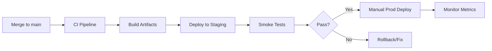

# Team Processes

This page documents how we work day-to-day. Following these processes helps us ship quality software efficiently.

## Development Workflow

### Branch Strategy

```
main
 │
 ├── feature/JIRA-123-add-new-provider
 │
 ├── bugfix/JIRA-456-fix-cache-timeout
 │
 └── hotfix/JIRA-789-critical-gfs-fix
```

- **main**: Production-ready code
- **feature/**: New functionality
- **bugfix/**: Non-critical fixes
- **hotfix/**: Critical production fixes

### Commit Messages

Follow conventional commits format:

```
<type>(<scope>): <description>

[optional body]

[optional footer]
```

Types:
- `feat`: New feature
- `fix`: Bug fix
- `refactor`: Code restructuring
- `docs`: Documentation
- `test`: Tests
- `chore`: Maintenance

Examples:
```
feat(gfs): add support for multi-city searches
fix(cache): resolve TTL not being set for provider responses
docs(runbook): add guide for high latency debugging
```

## Code Review

### PR Requirements

<Steps>
  <Step title="Create PR">
    - Clear title describing the change
    - Link to JIRA ticket
    - Description of what and why
    - Testing done
  </Step>
  <Step title="Automated Checks">
    - CI pipeline passes
    - Tests pass
    - Code style checks pass
    - Coverage thresholds met
  </Step>
  <Step title="Human Review">
    - At least 1 approval required
    - 2 approvals for critical paths
    - Address all comments
  </Step>
  <Step title="Merge">
    - Squash and merge preferred
    - Delete feature branch
  </Step>
</Steps>

### Review Guidelines

**As a reviewer:**
- Respond within 24 hours (working days)
- Be constructive and specific
- Approve if good enough, don't block on style preferences
- Use "nit:" prefix for non-blocking suggestions

**As an author:**
- Keep PRs small and focused
- Respond to all comments
- Don't merge without addressing blockers
- Request re-review after significant changes

### Critical Path Code

Extra scrutiny required for:
- GFS-related changes
- Search flow modifications
- Cache logic changes
- Payment/handoff flows

## Deployment

### Environments

| Environment | Purpose | Deployment |
|-------------|---------|------------|
| **Local** | Development | Manual |
| **Staging** | Integration testing | Auto on merge |
| **Production** | Live traffic | Manual trigger |

### Deployment Process



### Pre-Deployment Checklist

<Accordion title="Deployment Checklist">
- [ ] All tests passing
- [ ] Staging tested
- [ ] No blocking bugs
- [ ] Rollback plan ready
- [ ] Team notified in Slack
- [ ] Off-peak hours (if major change)
- [ ] Metrics dashboard open
</Accordion>

### Post-Deployment

1. Monitor key metrics for 15-30 minutes
2. Check error rates and latencies
3. Verify in production (sample searches)
4. Confirm in Slack channel

## Incident Response

### Severity Levels

| Level | Impact | Response Time | Examples |
|-------|--------|---------------|----------|
| **P1** | Complete outage | Immediate | Search down, GFS failing |
| **P2** | Major degradation | <30 min | High error rate, slow searches |
| **P3** | Minor issue | <4 hours | Single provider down |
| **P4** | Low impact | Next sprint | UI glitch, minor bug |

### Incident Flow

1. **Detect**: Alert fires or user report
2. **Acknowledge**: On-call acknowledges in PagerDuty
3. **Assess**: Determine severity and impact
4. **Communicate**: Update `#tech-oncall` with status
5. **Mitigate**: Fix or rollback to restore service
6. **Resolve**: Confirm service restored
7. **Post-mortem**: Document learnings (for P1/P2)

## Sprint Ceremonies

| Ceremony | Frequency | Duration | Purpose |
|----------|-----------|----------|---------|
| **Standup** | Daily (async) | - | Sync on progress/blockers |
| **Sprint Planning** | Bi-weekly | 1 hour | Plan upcoming work |
| **Retrospective** | Bi-weekly | 45 min | Improve processes |
| **Tech Sync** | Weekly | 30 min | Share learnings |

## Documentation

### What to Document

- **Must document**: Architecture decisions, runbooks, onboarding
- **Should document**: Complex features, integrations, debugging tips
- **Nice to have**: Tips, tricks, lessons learned

### Where to Document

| Content | Location |
|---------|----------|
| Knowledge base (this site) | `/docs` repo |
| Design docs, RFCs | Confluence |
| Code documentation | Inline + README |
| Runbooks | This site (`/runbooks`) |
| Meeting notes | Confluence |
